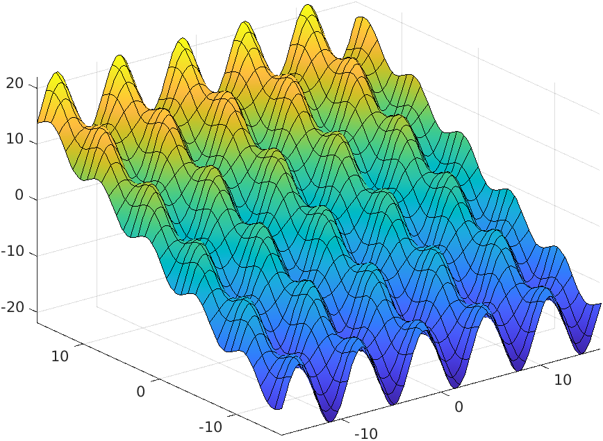
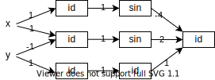

# Исследование влияния структуры нейронной сети на скорость и качество обучения

## Задание

Построить и обучить нейросети с различными структурами для "имитации" слеюдующей функции:

`f(x,y) = (sin(x-y) - 2 * sin(x)) * 2 + y`

на области, для которой (-16 <= x <= 16) и (-16 <= y <= 16)

Для каждой структуры сохранять статистику изменения ошибки с ростом числа эпох.
Для каждой структуры выполнять обучение на двух выборках: сетке с регулярным шагом (без тестовых данных) и случайной выборке точек из области определения.

Под структурой нейросети подразумевается количество слоёв, количество нейронов на каждом слое и функции активации на выходах слоёв.

## Подготовка эксперимента

### Описание нейронной сети

Для выполнения задания выбран ЯП Haskell.

- нейронная сеть описывается набором слоёв
  ```
   newtype NeuralNetwork = NeuralNetwork
   { layers :: [Layer] 
   }
  ```
- слой описывается матрицей весов связей между входами и выходами слоя, а также набором "функций активации"
  ```
  data Layer = Layer
  { weights :: Matrix Double,
    activators :: [ActivationFunction]
  }
  ```
- "функция активации" - это объект, позволяющий вычислить определённую функцию активации и её производную в указанной точке
  ```
  eval :: ActivationFunction -> 
    Double -> Double
  derivative :: ActivationFunction -> 
    Double -> Double
  ``` 
  В качестве функций активации будем использовать следующие функции:
  - логистическая функция активации
  - периодическая функция (синусоида)
  - функция гаусса
  - "отсутствующая" функция активации (`f(x) = x`)

Обучение нейросети будем производить методом обратного распространения ошибки. В качестве основы релизована следующая функция, позволяющая выполнить один шаг изменения весов для заданного набора входных и выходных данных
```
learnBatch :: Double -> Batch -> 
  NeuralNetwork -> NeuralNetwork
```
Здесь первый параметр - это параметр скорости обучения (обозначаемый обычно греческой буквой "эта")

Структуру нейронной сети будем описывать количеством входов и функциями активации на выходах слоёв:
```
data NetworkStructure = NetworkStructure
{ numberOfInputs :: Int,
  activationFunctions :: [[ActivationFunction]]
}
```

### Набор данных для обучения

Вот график исследуемой функции на заданной области определения:


Для выполнения задания необходимо провести по две серии экспериментов для каждой структуры нейронной сети:

1. выполнение обучения и тестирования на одном и том же наборе пар `([x,y], [f(x,y)])`, полученном для всех x и y взятых из области определения с шагом, равным длине отрезка допустимых значений по каждой координате, уменьшенной в `2^n` раз.
2. выполнение обучения на случайно выбранном наборе точек из области определения, а тестирования по набору точек из предыдущего эксперимента.

Для первого пункта положим `n=7`, тогда `x` и `y` будут меняться от `-16` до `16` с шагом `1/4`. Всего получится 129*129 = 16 641 пара координат. 
Для второго пункта выберем примерно на 30% меньше точек, то есть 10 000 случайных точек должны попасть в обучающий набор.

### Алгоритм обработки одной структуры

На вход алгоритму подаётся структура. По этой структуре создаются две нейронные сети, инициализируемые случайными весами. Далее одна сеть обучается по данным из набора 1, а вторая - по данным из набора 2, параллельно ведётся запись значения ошибки на тестовых и обучающих данных после каждой эпохи. Количество эпох обозначим `e`.

Для каждой структуры алгоритм должен отработать `k` раз. Скорость обучения зададим значением `a`. Таким образом, для каждой структуры алгоритм должен генерировать `2*k` файлов со статистиками обучения и `2*k` файлов с результирующими весами нейросети.

### Алгоритм генерации структур

Общий шаблон для всех структур будет таким: 
- число входов = 2
- последний слой состоит из единственного нейрона без функции активации

Максимальное число скрытых слоёв обозначим `L`, а максимальное число нейронов в слое - `N`. 

Хотелось бы перебрать все возможные комбинации функций активации для любого количества слоёв от 1 до `N` и любого количества нейронов на слое, однако мы не сможем этого сделать ввиду того, что такая серия экспериментов требует достаточно большого количества времени (счёт идёт на годы). Поэтому будем перебирать только слои содержащие синусоиду и логистическую функции активации. 

Можно было бы попытаться использовать `f(x)=x` в качестве функции активации, но для сетей с ней алгоритм обратного распространения ошибки работает очень плохо, ведь у этой функции не ограничена область значений.

Зададим `L` равным 3, а `N` - 4. Этого должно хватить чтобы получить нейронную сеть способную в точности повторить поведение заданной функции. Было бы интересно рассмотреть большие числа, но даже при столь невеликих параметрах общее число структур - 2954, что достаточно много.

### Предполагаемый результат эксперимента

В нашем случае функцию можно задать, например, следующей структурой сети:



Скорее всего, результаты будут наилучшими для структур, похожих на эту.

## Результаты эксперимента

Пока что эксперимента нет )