Исследование влияния структуры нейронной сети на скорость и качество обучения

# 1. Задание

Дана следующая функция:
`f(x,y) = (sin(x-y) - 2 * sin(x)) * 2 + y`

1. Обучить нейронную сеть для имитации указанной функции двумя способами:
   - Используя случайный набор данных
   - Используя в качестве входных точек узлы равномерной сетки со вдвое уменьшающимся шагом
   Проанализировать результаты.
2. Обучить нейронную сеть для имитации указанной функции, рассмотреть зависимость качества обучения от числа эпох (ёмкости обучения)
3. Обучить нейронные сети с различными структурами для имитации указанной функции, рассмотреть зависимость качества обучения от числа слоёв и нейронов на слое. 

Вот график целефой функции:
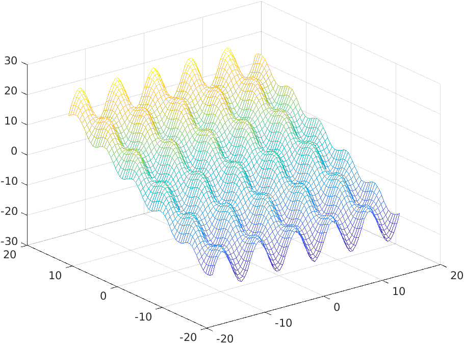

# 2. Подготовка экспериментов

Для выполнения задания необходимо написать программу для обучения и использования нейронных сетей, для этого воспользуемся языком программирования Haskell: строгая типизация и функциональность хорошо подходят для описания математических моделей, например нейронных сетей.

## 2.1. Описание нейронной сети

Нейронная сеть состоит из слоёв, слои из нейронов и связей с нейронами предыдущего слоя, нейрон позволяет задать функцию активации. Таким образом, приходим к следующему описанию нейронных сетей на Haskell:
```
data ActivationFunction = Logistic | Th | No | Periodic | Gauss
eval :: ActivationFunction -> Double -> Double
derivative :: ActivationFunction -> Double -> Double

data Layer = Layer
  { weights :: Matrix Double,
    activators :: [ActivationFunction]
  }

newtype NeuralNetwork = NeuralNetwork {layers :: [Layer]} deriving (NFData, Generic)
```

Под структурой нейронной сети будем понимать информацию о количестве и функциях активации нейронов в слоях сети: 
```
data NetworkStructure = NetworkStructure
  { numberOfInputs :: Int,
    activationFunctions :: [[ActivationFunction]]
  }
``` 

Обучение будем проводить методом обратного распространения ошибки. 

Простейший эксперимент представим функцией `handleNetwork`:
```
handleNetwork :: FilePath -> Int -> [Batch] -> Batch -> Double -> NetworkStructure -> IO ()
handleNetwork filePath epochCount trainingBatches testBatch eta networkStructure = -- ...
``` 

Эта функция позволяет задать следующие параметры для обучения сети:
- структура нейронной сети
- количество эпох обучения
- пакеты тренировочных данных
- пакет тестовых данных
- параметр, регулирующий скорость обучения
- путь к файлу для записи результатов

В начале работы в файл записываются веса нейронной сети, выбранные случайно для указанной сруктуры, после каждой эпохи в файл добавляется строка с информацией об ошибке на тренировочныхи тестовых данных, в конце снова выводятся веса всех связей в сети, а также матрица, в формате, пригодном для matlab, содержащая значения функции для построения графиков. (Графики тоже будем строить в matlab т.к. он подходит для этого лучше, чем haskell).

## 2.2. Эксперимент для оценки влияния набора данных на качество обучения сети

Возьмём нейронную сеть со следующей структурой: 2 скрытых слоя по 10 нейронов с логистической функцией активации, на выходном слое оставим единственный нейрон с линейной функцией активации, так как она имеет неограниченную область значений. 

Эксперимент опишем следующей функцией:
```
experiment1 :: IO ()
experiment1 = do
  let steps = 2 : 1 : ([1 .. 3] & map (0.5 ^))
  steps
    & map
      ( \step -> do
          handleNetwork 
            ("exp1_regular_" ++ show step) 300 (sampleBatch step) testData 0.0001 (simpleStructure [10, 10])
          let count = (32.0 / step) ^ 2 & round
          randomB <- randomBatch count
          handleNetwork 
            ("exp1_random_" ++ show count) 300 randomB testData 0.0001 (simpleStructure [10, 10])
      )
    & foldl1 (>>)
```

Из результатов этого эксперимента нам понадобятся следующие данные: графики значений нейронной сети на проверочных данных, значения ошибки на последней эпохе.

## 2.3. Эксперимент для оценки влияния ёмкости обучения на его качество

Структуру нейронной сети возьмём как в предыдущем эксперименте. Проведём 700 эпох обучения на узлах двумерной равномерной сетки с шагом 0.25. Вот код функции эксперимента:
```
experiment2 :: IO ()
experiment2 = do
  handleNetwork "exp2" 3000 (sampleBatch 0.25) testData 0.0001 (simpleStructure [10, 10])
```

Анализировать будем график зависимости среднего квадрата ошибки сети от номера эпохи. Также рассмотрим график результатов работы сети на проверочных данных.

## 2.4. Эксперимент для оценки влияния структуры сети на качество обучения

Будем рассматривать следующие структуры сети:
```
NetworkStructure 2 $ replicate l (replicate n Logistic) ++ [[No]] 
```
Здесь `l` задаёт число слоёв, `n` - число нейронов на каждом слое. В качестве функции активации взята только логистическая, так как она лучше подходит для метода градиентного спуска (все попытки добавления периодической функции активации в слои заканчивались тем, что средний квадрат ошибки изменялся хаотично при росте числа эпох. Возможно неправильна была выбрана скорость обучения сети). 

Вот функция для проведения эксперимента:
```
experiment3 :: IO ()
experiment3 = do
  let namedStructure = (\l n -> (show l ++ "l " ++ show n ++ "n", simpleStructure (replicate l n)))
  let structures = [namedStructure layers neurons | layers <- [1 .. 4], neurons <- [10, 15 .. 30]]
  structures
    & map
      ( \(name, structure) -> do
          handleNetwork ("exp3_" ++ name) 300 (sampleBatch 0.25) testData 0.0001 structure
      )
    & foldl1 (>>)
```

Из результатов эксперимента нам пригодятся значения среднего квадрата ошибки на последней эпохе.

# 3. Результаты экспериментов

Рассмотрим результаты экспериментов и проанализируем их.

## 3.1. Эксперимент для оценки влияния набора данных на качество обучения сети

Вот результаты первого эксперимента:

- **Для равномерной сетки**
  
  Вот шаги сетки и графики отклика нейронной сети на проверочных данных:
  - Шаг 2.0:
    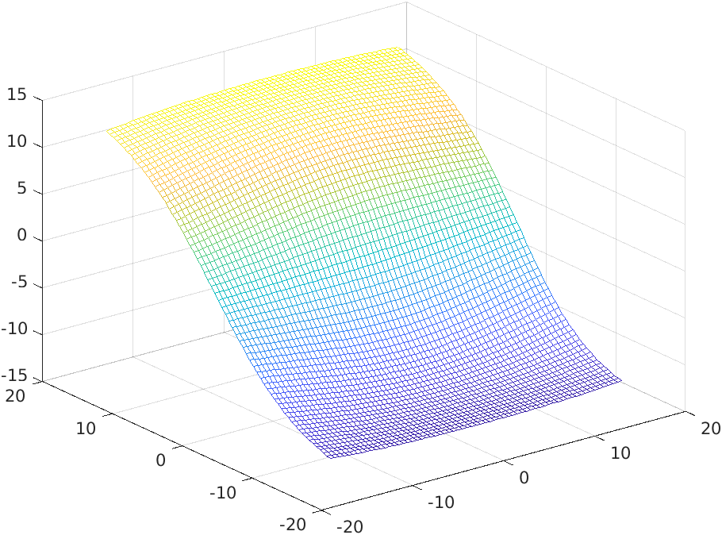
  - Шаг 1.0:
    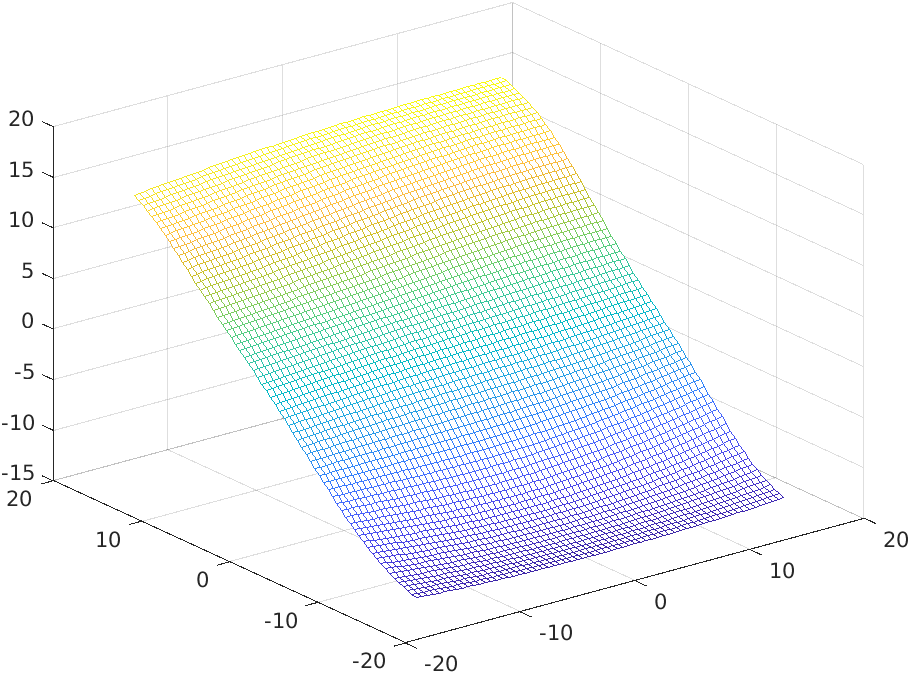
  - Шаг 0.5:
    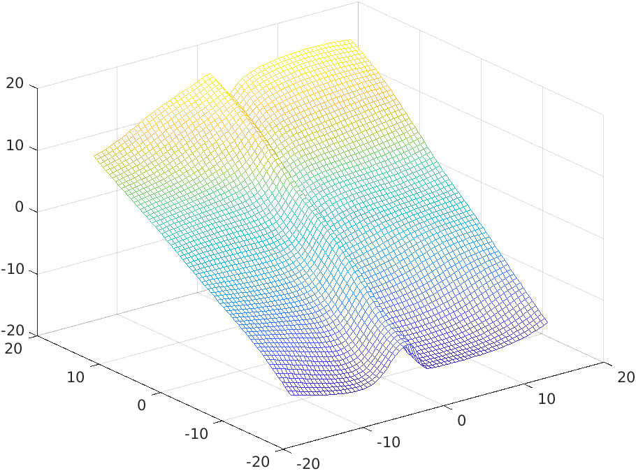
  - Шаг 0.25:
    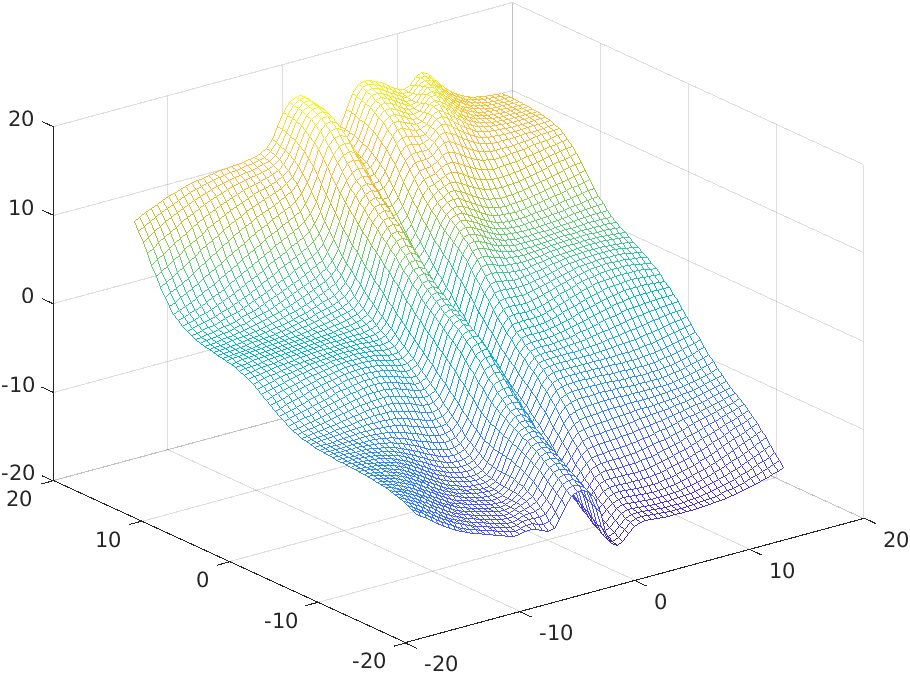
  - Шаг 0.125:
    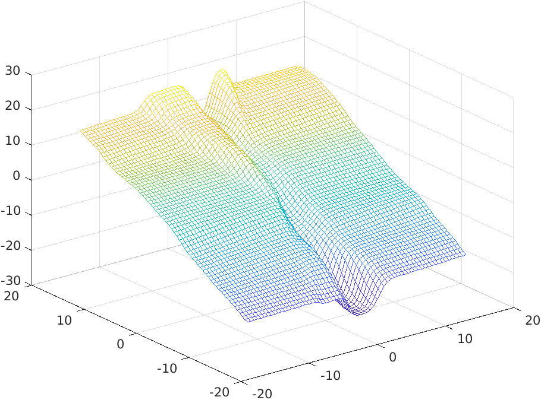

  Рассмотрим теперь средний квадрат ошибки сети на последней эпохе.

  | Шаг | средний квадрат ошибки на тренировочных данных | средний квадрат ошибки на тестовых данных | оценка графика |
  | - | - | - | - |
  | 2.0 | 13.6870 | 12.9979 | волны не выражены |
  | 1.0 | 11.3039 | 11.2559 | волны не выражены |
  | 0.5 | 12.5919 | 12.5762 | чётко видна одна волна |
  | 0.25 | 17.5970 | 17.5786 | чётко видна одна волна, также начинает проявляться полуволна рядом |
  | 0.125 | 12.7691 | 12.7691 | чётко видна впадина от одной волны |

- **Для случайных данных**
  
  Вот количества точек и графики отклика нейронной сети на проверочных данных:

   - 256 точек: 
    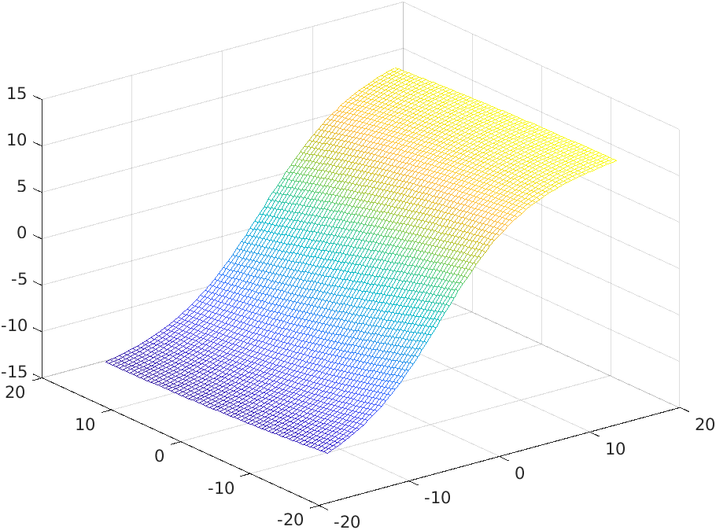

   - 1024 точки: 
    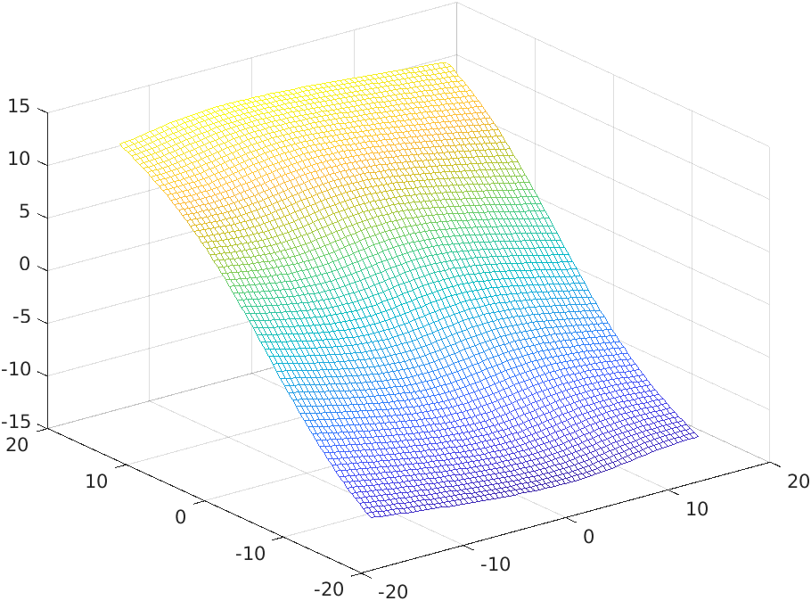

   - 4096 точек: 
    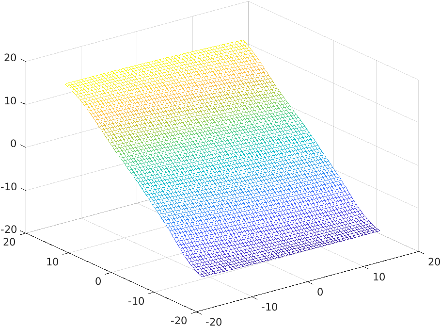

   - 16384 точки: 
    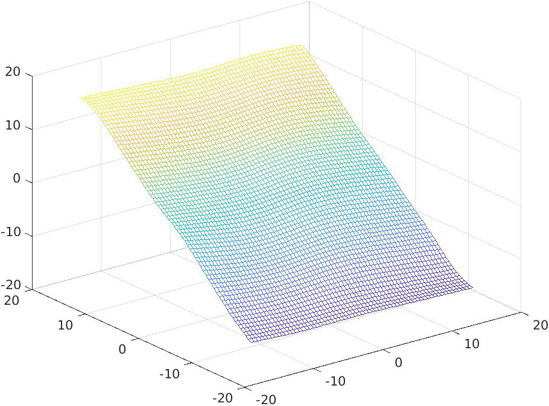

   - 65536 точек: 
    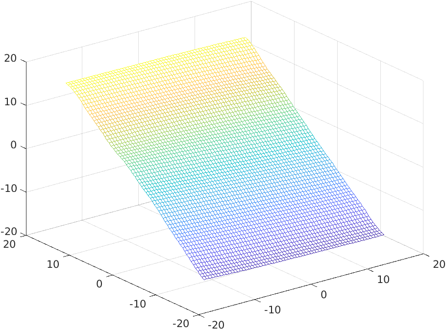

  Рассмотрим теперь средний квадрат ошибки сети на последней эпохе.

  | Количество точек | средний квадрат ошибки на тренировочных данных | средний квадрат ошибки на тестовых данных | оценка графика |
  | - | - | - | - |
  | 256 | 13,.1095 | 13.4193 | волны не выражены |
  | 1024 | 11.4725 | 11.1380 | волны не выражены |
  | 4096 | 10.0417 | 10.0522 | волны не выражены |
  | 16384 | 9.7801 | 9.7801 | волны не выражены |
  | 65536 | 9.8469 | 9.9137 | волны не выражены |

**Выводы по эксперименту**
  
Интересно, что относительно небольшое значение среднего квадрата ошибки нейронной сети на проверочных данных не означает, что поведение нейронной сети похоже на поведение функции. Наиболее сильно это заметно при обучении на случайной выборке. Если рассматривать средний квадорат ошибки как показатель качества обучения, то наиболее хорошо себя показывает обучение на большом количестве случайных данных. Если же учитывать поведение нейросети (то, насколько график её отклика походж на график целевой функции), то наилучшим оказывается обучение нейронной сети по точкам равмносерной сетки с наименьшим шагом. 

## 3.2. Эксперимент для оценки влияния ёмкости обучения на его качество

Вот график зависимости среднего квадрата ошибки нейронной сети от количества эпох обучения:

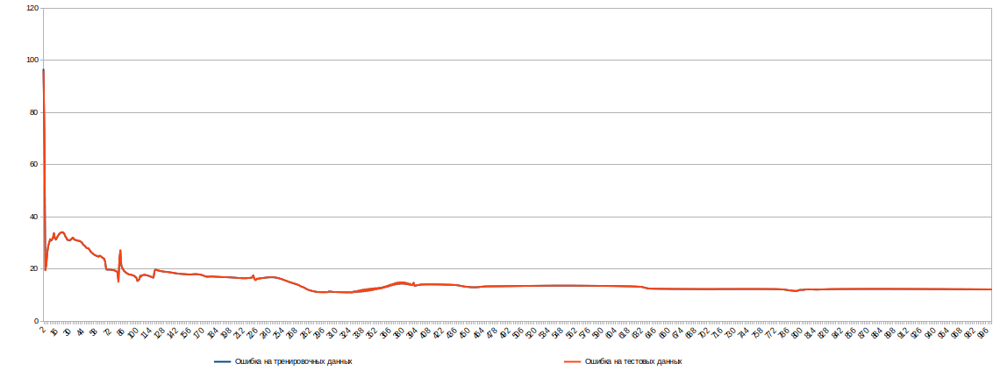

Видим, что в первой трети графика ошибка уменьшается, а после этого "выходит на плато".

Рассмотрим  теперь отклик нейросети на проверочных данных:

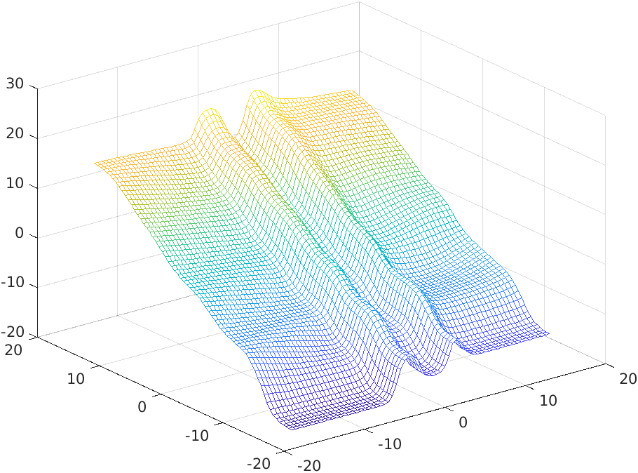

Видим, что нейронная сеть достаточно хорошо "выучила" две волны. Возможно, что если проводить обучение достаточно долго, то локальный минимум ошибки будети преодолён и сеть "выучит" ещё волны целевой функции. 

**Вывод по эксперименту**

С ростом числа эпох ошибка нейросети, как правило, уменьшается.

## 3.3. Эксперимент для оценки влияния структуры сети на качество обучения

В следующей таблице приведены средние квадраты ошибки нейронных сетей с различными структурами, а также дана характеристика изменению ошибки с ростом числа эпох.

Приведено значение ошибки на тестовых данных, ошибка на тренировочных данных отличается не более чем на 0.03.

| - | 1 слой  | 2 слоя  | 3 слоя  | 4 слоя  |
|-|-|-|-|-|
| 10 нейронов | 13.1015 | 12.5166 | 14.7261 | 12.1500 |
| 15 нейронов | 10.2494 | 12.5756 | 11.4759 | 10.8835 |
| 20 нейронов | 11.7797 | 12.3275 | 12.9301 | 12.6993 |
| 25 нейронов | 12.4065 | 17.1489 | 10.3695 | 11.9398 |
| 30 нейронов | 11.9239 | 12.6016 | 12.0245 | 12.9308 |

**Выводы по эксперименту**

Судя по таблице ни одна из структур не оказалась способна "выучить" все волны целевой функции. Возможно, структура, подходящая для моделирования целевой функции, должна содержать периодические функции активации, однако, как было указано в главе о подготовке к экспериментам, для них градиентный спуск работает достаточно плохо.

# Вывод

Разработаны функции для обучения нейронных сетей, сделана попытка изучить влияние различных параметров обучения на его качество. Обучить нейронную сеть моделированию целевой функции не удалось: ни одна сеть не дала средний квадрат ошибки меньше 1. 